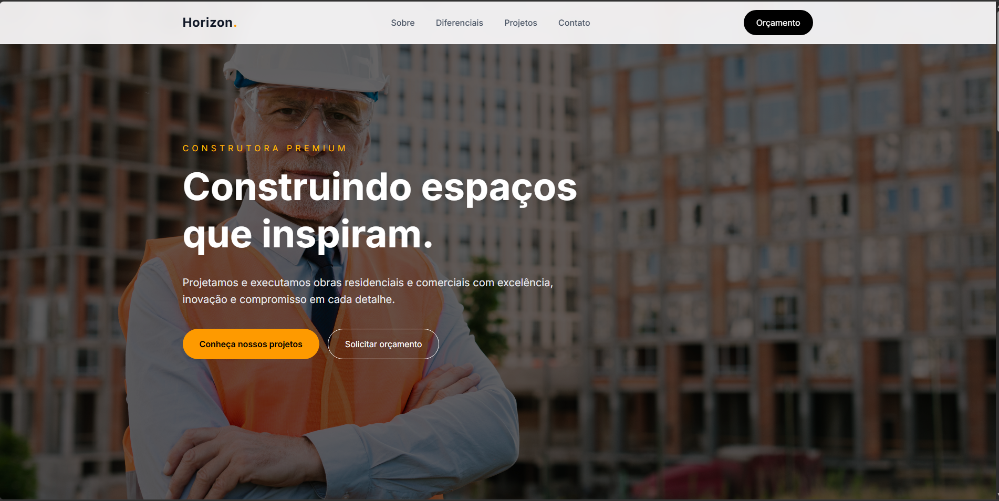
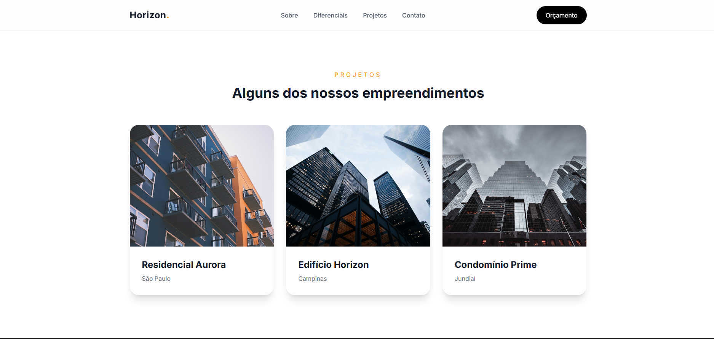
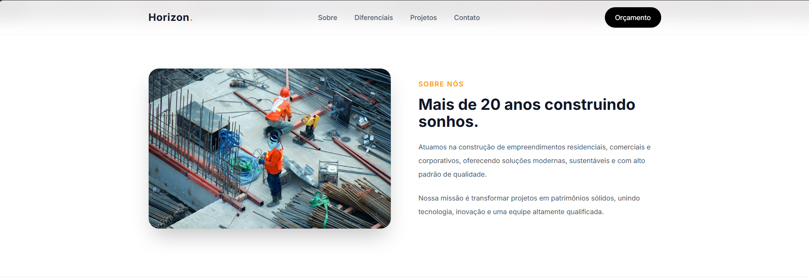
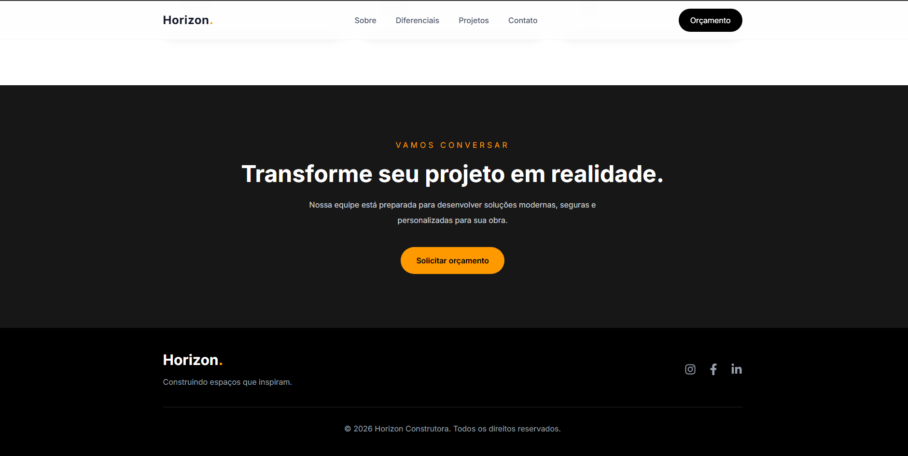
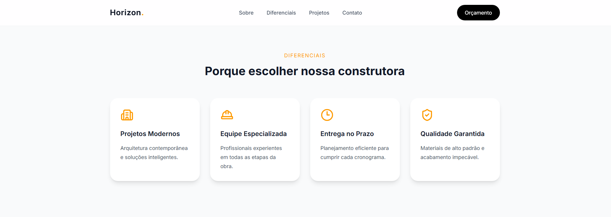

# React UI Study

Estudo desenvolvido para praticar conceitos de Front-end utilizando **React** e **Tailwind CSS**, com foco em componentização, responsividade e experiência do usuário.

## 🚀 Tecnologias

- React
- TypeScript
- Vite
- Tailwind CSS

## 🎯 Objetivos

- Componentização
- Reutilização de componentes
- Organização da arquitetura
- Responsividade (Mobile First)
- UX/UI
- Hierarquia visual
- Clean Code

## 📷 Screenshots

### Home



### Produtos



### Detalhes



### Carrinho



### Mobile



## ⚙️ Como executar

```bash
git clone https://github.com/seu-usuario/seu-repositorio.git

cd seu-repositorio

npm install

npm run dev
```

## 📚 Aprendizados

Durante este estudo foram praticados conceitos como:

- Estruturação de aplicações React
- Componentes reutilizáveis
- Organização de pastas
- Layout responsivo
- Boas práticas com Tailwind CSS
- Criação de interfaces focadas em UX

## 👨‍💻 Autor

Gabriel Campos
